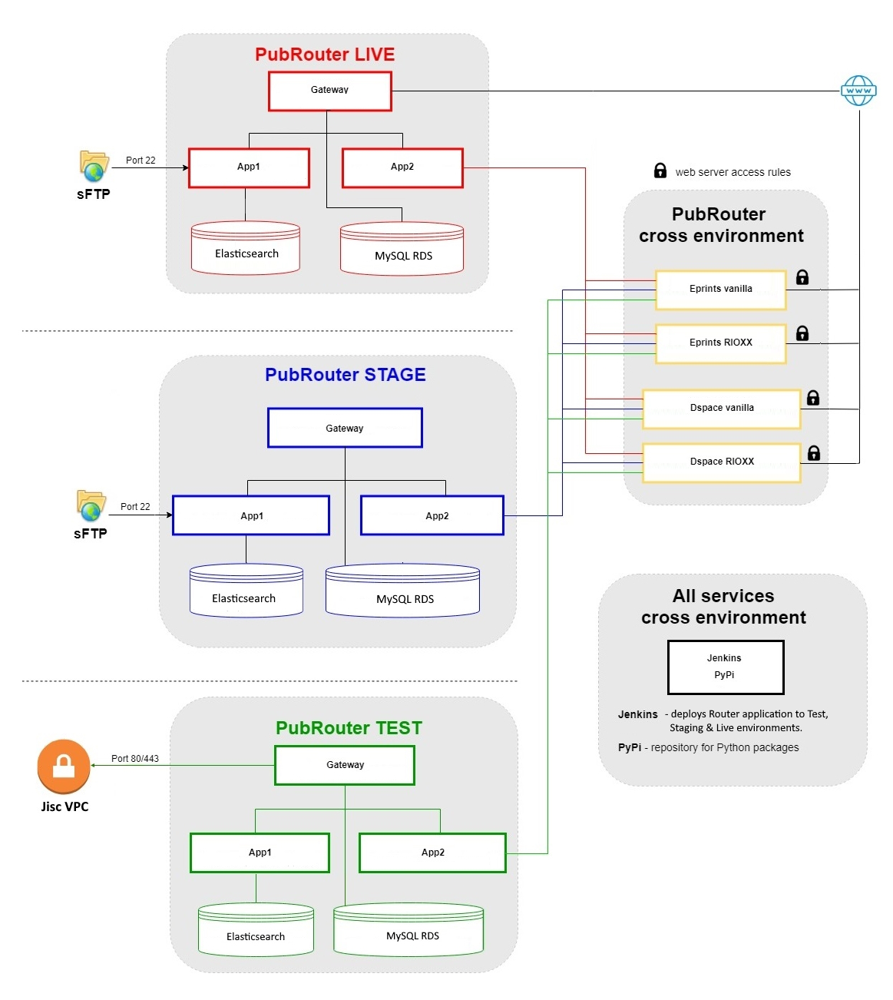

# AWS Infrastructure

Router runs on AWS infrastructure.  The servers in each of the environments, are managed under separate AWS accounts:

| Environment | AWS Account             | Notes                                                                |
|------|-------------------------|----------------------------------------------------------------------|
| Production environment | xxxx-xxxx-prod     |                                                                      |
| Staging (UAT) environment | xxxx-xxxx-stage |                                                                      |
| Test environment | xxxx-xxxx-test         |                                                                      |
| Shared servers | xxxx-xxxx-test  | * PyPi/Jenkins server * Eprints vanilla server * Eprints RIOXX server |

## AWS server infrastructure diagram

## Production environment servers

Note that recent servers are named 'her-...', slightly older servers are named 'dr-...'.

| Server name                  | Description  | Private IP    | Public IP       | Specification | Notes                 |
|------------------------------|---|---------------|-----------------|------------|---------------------------------|
| xxxx-xxxx-pubroutergw-1    | Gateway server               | xxx.xxx.xxx.xxx | xxx.xxx.xxx.xxx  | t3.medium | Was originally a micro, but larger server was needed to have sufficient RAM to enable pass through of large file SFTP deposits (to App1).      |
| xxxx-xxxx-pubrouterapp-1   | Application server #1 (App1) | xxx.xxx.xxx.xxx | xxx.xxx.xxx.xxx | t3.medium | Has attached disk storage (mapped to <code>/Incoming</code>).              |
| xxxx-xxxx-pubrouterapp-2   | Application server #2 (App2) | xxx.xxx.xxx.xxx | xxx.xxx.xxx.xxx | t3.medium | Has attached disk storage (mapped to <code>/Incoming</code>).                   |
| xxxx-xxxx-pubrouteres-2     | Elasticsearch server         | xxx.xxx.xxx.xxx | xxx.xxx.xxx.xxx  | t3.small | Server is scheduled to run only for a couple of hours each night when the Harvest process runs. Because Elasticsearch is used only for interim storage by the harvest process there is no need for backups or fault tolerance. |
| **Aurora MySQL instance**    | |               |                 | |                                      |
| xxxx-xxxx-pubrouter-cluster | MySQL database  |  |  |  |   |

## Staging / UAT / Pre-production environment servers
| Server name                 | Description  | Private IP      | Public IP      | Specification | Notes                                                   |
|-----------------------------|---|-----------------|----------------|---------------|---------------------------------------------------------|
| xxxx-xxxx-pubroutergw-1 | Gateway | xxx.xxx.xxx.xxx |xxx.xxx.xxx.xxx    | t3.micro      |                                                         |
| xxxx-xxxx-pubrouterapp-1  | Application server #1 (App1) | xxx.xxx.xxx.xxx | xxx.xxx.xxx.xxx  | t3.micro      |                                                         |
| xxxx-xxxx-pubrouterapp-2  | Application server #2 (App2) | xxx.xxx.xxx.xxx | xxx.xxx.xxx.xxx | t3.micro      |                                                         |
| xxxx-xxxx-pubrouteres-1   | Elasticsearch | xxx.xxx.xxx.xxx | xxx.xxx.xxx.xxx  | t3.micro      | Used only ~2 hour/night by Harvester as temporary store |
| **Aurora MySQL instance**    | |  | | |                                                         |
| xxxx-xxxx-pubrouter-cluster       | MySQL database | | | |                                                         |

## Test environment servers
| Server name                 | Description  | Private IP       | Public IP | Specification | Notes                                                   |
|-----------------------------|---|------------------|-----------|------------|---------------------------------------------------------|
| xxxx-xxxx-pubroutergw-1 | Gateway | xxx.xxx.xxx.xxx  | xxx.xxx.xxx.xxx | t3.micro |                                                         |
| xxxx-xxxx-pubrouterapp-1 | Application server #1 (App1) | xxx.xxx.xxx.xxx  | xxx.xxx.xxx.xxx | t3.micro |                                                         |
| xxxx-xxxx-pubrouterapp-2 | Application server #2 (App2) | xxx.xxx.xxx.xxx  | xxx.xxx.xxx.xxx | t3.micro |                                                         |
| xxxx-xxxx-pubrouteres-1 | Elasticsearch  | xxx.xxx.xxx.xxx  | xxx.xxx.xxx.xxx | t3.micro | Used only ~2 hour/night by Harvester as temporary store |
| **Aurora MySQL instance**    | |                  | | |                                                         |
| xxxx-xxxx-pubrouter-cluster | MySQL database |                  | | |                                                         |

## Shared servers (across environments)
| Server name     | Description  | Private IP      | Public IP       | Specification | Notes          |
|-----------------|---|-----------------|-----------------|---------------|-----------------------------------|
| xxxx-xxxx-admin-1 | Jenkins, PyPi | xxx.xxx.xxx.xxx | xxx.xxx.xxx.xxx | t3.small | Runs instances for the following services: * Jenkins * PyPi (with separate Dev & Live endpoints). |
| xxxx-xxxx-eprints-1 | Eprints "vanilla" test server | xxx.xxx.xxx.xxx | xxx.xxx.xxx.xxx | t3.small |                        |
| xxxx-xxxx-eprints-2 | Eprints "RIOXX" test server | xxx.xxx.xxx.xxx | xxx.xxx.xxx.xxx | t3.small  |          |
| NOT CONFIGURED | DSpace "vanilla" test server | |                 | |                        |
| NOT CONFIGURED | DSpace "RIOXX" test server | |                 | |                 |
