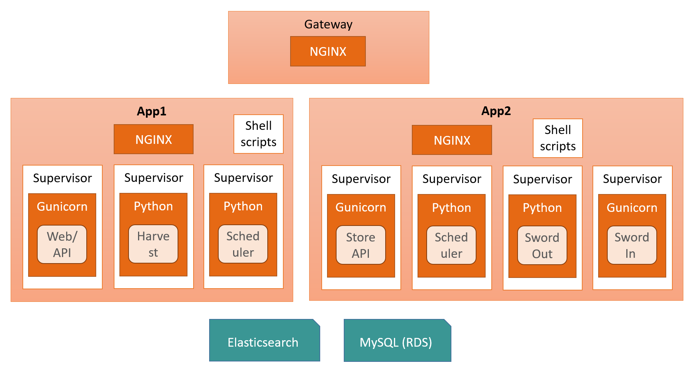
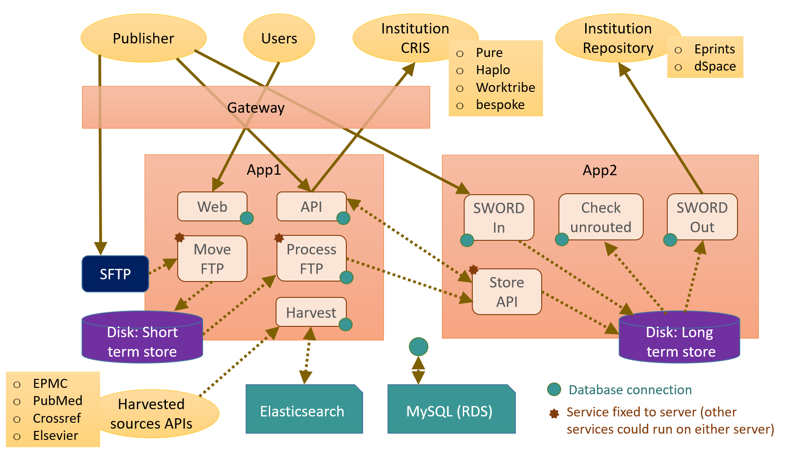

# Router Architecture

## Application Architecture

Router has a 3 tier architecture.

| Tier | Technology | Notes |
|---|---|---|
| Web | * NGINX * Gunicorn web server | * NGINX runs on different servers, providing reverse proxy service & proxy services * Web server |
| Application | * Supervisorctl  * Python / Flask * Gunicorn | * Linux application control * Application code provides Web (GUI) and API interface; Scheduler "batch" application services; Harvester service; SWORD-Out service; SWORD-In service. |
| Data | * MySQL * Elasticsearch | * Primary database * Temporary store used by Harvester process |
 

## Service Architecture

The principal services that together comprise the Publications Router application are summarised here.

| Service | Key functions | Notes |
|--|---|-----|
| Web GUI | * presentation of Router website & all associated functionality | WEB GUI and Router API are, by default, provided by ***jper*** App (_web_main.py_). However there is a Jenkins deployment option which allows WEB GUI and API to be provided as separate services (on separate App servers) - in that case _web_main.py_ provides the Website for ***xweb*** app, and _xapi_main.py_ provides API for **_xapi_** app).   Web static files are located on App1 server, this includes report files generated each month.  |
| Router API | * Publisher deposit of notifications * Publisher test deposit of notifications * Institution retrieval of notifications * Institution upload/download of matching parameters | Functional overview: * Deposited notifications are saved as *Unrouted notfications* in MySQL db *notification* table * *Routed notifications* are retrieved by institutions * See [API documentation](https://github.com/jisc-services/Public-Documentation/tree/master/PublicationsRouter/api#publications-router-api).   API is provided either by the same Python App as the Web GUI (***jper*** via _web_main.py_) or by separate App (**_xapi_** via _xapi_main.py_) depending on Jenkins deployment options. |
| Harvester | Harvesting article notifications from the following sources: * Elsevier * Crossref * PubMed * EPMC. | * Runs once per day, overnight, as a separate Python Harvester App * Uses Elasticsearch as temporary, intermediate datastore * Results in *Unrouted notfications* inserted into *harvested_unrouted* MySQL database table.  |
| Move FTP deposits | Move deposited notification packages (zip files) from a Publisher's SFTP directory (on App1 server), to a temporary directory on same server. | * Step 1 of 2 part SFTP ingest process * Service is a function that is run at regular intervals by Scheduler App * Must run on SFTP (App1) server.  |
| Process FTP deposits | Process packages in temporary directory: * validate * create *Unrouted notifications* (inserted into db) * repackaged & move to longer term storage (on App2 server). | * Step 2 of 2 part SFTP ingest process * Service is a function that is run at regular intervals by Scheduler App * Must run on SFTP (App1) server.  |
| Route | Process *Unrouted notifications* created by Publisher deposit: * Match notification to Repositories by comparing notification metadata (author affiliations, grant information etc.) with Institutions *Matching parameters*  * Perform duplicate checking (using DOI)  * Convert matched notfications to *Routed notifications*  * Delete unmatched notifications. | * Service is a function that is run at regular intervals by Scheduler App * Currently runs on App2 server (co-located with long term package store).   |
| Route harvested | Process *Harvested Unrouted notifications* (created by Harvester): * Match notification to Repositories by comparing notification metadata (author affiliations, grant information etc.) with Institutions *Matching parameters*  * Perform duplicate checking (using DOI)  * Convert matched notfications to *Routed notifications*  * Delete unmatched notifications. | * Service is a function that is run at regular intervals by Scheduler App * Currently runs on App2 server (co-located with long term package store).   |
| SWORD-Out | Sends notifications to Institutional repositories using SWORD2 protocol.   Two repository types are supported: * DSpace * Eprints. For each of these 2 different XML formats are supported: * 'Vanilla' (basic) * 'RIOXX' (based on RIOXX specification) | * Service can be deployed to run as either:  &nbsp; * a job (function) executed by Scheduler App  &nbsp; * or, as a stand-alone Python SWORD-Out App * Currently runs on App2 server as a Job within Scheduler App (rather than as a stand-alone app).   |
| SWORD-In | An endpoint for publishers to send deposits to Router using the SWORD2 protocol.  (This is an alternative to using SFTP or Router's API).  | * Service is deployed as a stand-alone Python SWORD-In App * Currently runs on App2 server.   |
| Reporting | Monthly process to generate reports. | Function/job is run by Scheduler App on Web (App1) server - it writes files to directories used by Web GUI.   |
| DB Data deletion | Daily processes to remove old records from database. | The database record deletion job (function) is run by Scheduler App on App1 or App2 server (currently App2).  |
| Data file deletion | Daily processes to remove old files from filestore directories (runs on both App1 & App2). | * File deletion is done by shell scripts (on both App1 & App2) which are executed by the Python `scheduler.py` program. On both servers the affected directories sit beneath the <code>/Incoming</code> directory.|
| Store | Long term (3 month) storage of package files (& unpacked versions of the same). It has two interfaces: * Storage API (used from App1 server) * Direct disk access (used from App2 server, where the filestore is located) | The long term filestore is located on App2 server in <code>/Incoming/store</code> directory.  |
| MySQL | Persistent data storage | AWS Aurora MySQL instance.|
| Elasticsearch | Temporary data storage (Harvester use only) | A single AWS ec2 server. No need for fault-tolerant ES cluster because all data is deleted after harvest process runs.|
 

## Server Architecture

Router uses [AWS ec2 servers and Aurora MySQL database](./AWS_infrastructure.md) in each of 3 environments:
* Test
* UAT / Staging / Pre-production
* Production.

The table below shows baseline service deployment across servers (@ October 2025). Note, however, that distribution of services across the physical servers can be altered by parameters set during Jenkins deployment - so this should be considered a baseline. Note that it would also be possible to combine all services onto a single Application server (instead of distributing them across 2 servers as is currently done). 

| Function | AWS technology | Application technology | Services |
|---|----|---|---|
| ***Top tier***|
| Gateway server | ec2 server | NGINX | Reverse Proxy |
| ***Application tier***|
| Application server #1 (App1) | ec2 server | * NGINX * Gunicorn web server1 * Python / Flask application | * Proxy service * SFTP server * Short term file store * Web/API application service1 * Scheduled "batch" services:2 &nbsp;&nbsp; * Harvester &nbsp;&nbsp; * Move FTP deposits &nbsp;&nbsp; * Process FTP deposits &nbsp;&nbsp; * Reporting &nbsp;&nbsp; * File deletion &nbsp;&nbsp; * Data deletion. |
| Application server #2 (App2) | ec2 server | * NGINX * Gunicorn web server * Python / Flask application | * Proxy service * 3 month file store * Store API * Scheduled "batch" services:2 &nbsp;&nbsp; * Route &nbsp;&nbsp; * Route harvested &nbsp;&nbsp; * SWORD-Out service &nbsp;&nbsp; * File deletion &nbsp;&nbsp; * Data deletion * SWORD-In service. |
| ***Data tier***|
| Database server | Aurora | MySQL | Primary persistent database |
| Database server | ec2 server | Elasticsearch | Temporary data store used by Harvester (for an hour or two overnight) |

#### Notes
1) Web and API services can be run on separate servers e.g. Web on App1 server & API on App2 server, this requires (1) Amending Gateway NGINX routing configuration so Web and API traffic are routed to relevant server; (2) Setting Jenkins service deployment parameters so that required Web & API services run on the particular servers. 
2) Distribution of certain "batch" services (*Route*, *Route harvested*, *SWORD-Out*, *Data deletion*) across servers is determined by Jenkins service deployment parameters. _SWORD-Out_ can be deployed as a separate Python App or as a job (function) run by Scheduler App. 
 

## Application Deployment Architecture

Router is deployed as executable application components that execute under the control of Supervisorctl. Each supervisor component executes either a Python/Flask application, or a Gunicorn webserver, which itself spawns processes that each run a particular Python/Flask application.

The way in which application components are deployed is determined by both [preset configuration](/deployment/README.md) in the git project <code>/deployment</code> directory, and parameters passed to Jenkins build jobs.

The Router application, written in Python v3, is built using a mixture of publicly available Python packages and the bespoke packages noted below which are created by Jenkins jobs and stored on Router's PyPi server.

### Router bespoke python packages (PyPi)

Router's bespoke packages are created by Jenkins jobs and stored on the Router PyPi server which is also shared with Jenkins (see [AWS infrastructure shared servers](./AWS_infrastructure.md) and [Build/Deployment](./Build_Deployment.md) pages). 

PyPi URLs for Dev & Live packages (NB. accessible only via Jisc VPN):
* Dev packages: http://dev_pypi.XXXX.YYYY.jisc.ac.uk/
* Live packages: http://live_pypi.XXXX.YYYY.jisc.ac.uk/.

| Package name | Description | Git repository                                    |
|---|---|---------------------------------------------------|
| router | Router application code. | https://github.com/jisc-services/oa-PubRouter-App |
| octopus | Octopus shared library.| https://github.com/jisc-services/oa-PubRouter-Octopus      |
| python-sword2 | SWORD2 library.| https://github.com/jisc-services/oa-python-sword2          |

**IMPORTANT** - The python package versions are defined by the content of files named *VERSION* located at the source root of each Git repository.

### Executable Application deployment across servers

NOTES on graphic above:
1. it has _Web_ & _API_ services being provided by a single Python App (_jper_) on App1; however there is a deployment option to separate these, with _Web_ service (_xweb_) running on App1 & _API_ (_xapi_) running on App2. 
2. it shows _SWORD-Out_ service running as a separate Python App, however it can alternatively be deployed as a job (function) that is run by the Scheduler App - which reduces the overall number of separate Python Apps.
3. it shows _Scheduler_ running on both App servers, though it can be deployed to run on only App1. 

### Executable components

| Component | Description  |
|---|----|
| **App1 Server** |  |
| Gunicorn: Web/API (_jper_) | Gunicorn is configured to run 4 instances of the Web/API Flask application, each of which can manage 1000 active connections. Gunicorn automatically starts a new instance if one fails.  The Web/API application (_jper_) provides **both** Router Website and Router API endpoints (URLs).  The Gateway NGINX server must be configured to route Web & API traffic to App1 server, on particular port numbers.  It is possible to run the Web and API service on separate servers by running the Gunicorn Web component (_xweb_) on App1 & Gunicorn API (_xapi_) on App2, and configuring Gateway NGINX so that Web traffic is routed to App1 server, and API traffic to App2.   |
| Gunicorn: Web (_xweb_) | This is an alternative to running Gunicorn: Web/API component, and must be used in conjunction with Gunicorn: API (_xapi_) on App2 server.  Gunicorn is configured to run 4 instances of the Web Flask application, each of which can manage 1000 active connections. Gunicorn automatically starts a new instance if one fails.  The Gateway NGINX server must be configured to route Web traffic to App1 server.   |
| Python: Harvest | The harvester is configured to run once overnight, at a time determined by the overall Router schedule specified in global config.   |
| **App2 Server**|  |
| Gunicorn: API (_xapi_) | This is an alternative to running Gunicorn: Web/API component on App1, and must be used in conjunction with Gunicorn: Web (_xweb_) on App1 server.  Gunicorn is configured to run 4 instances of the Web Flask application, each of which can manage 1000 active connections. Gunicorn automatically starts a new instance if one fails.  The Gateway NGINX server must be configured to route API traffic to App2 server.   |
| Gunicorn: Store API | Gunicorn is configured to run 4 instances of the Store API Flask application, each of which can manage 1000 active connections.  |
| Python: SWORD-Out | The SWORD-Out service is configured to run at repeating times throughout the day at times determined by the overall Router schedule specified in global config.  NOTE: It is currently run as a scheduled job (function) by **Python: Scheduler** (see below), however it was originally deployed as a separate stand-alone Python App - which is why it is documented separately here.|
| Gunicorn: SWORD-In |  Gunicorn is configured to run 3 instances of the SWORD-In Flask application, each of which can manage 1000 active connections. Gunicorn automatically starts a new instance if one fails.  The SWORD-In application (_sword_in_) provides a SWORD2 endpoint (URL) for publishers to submit article deposits (rather than using SFTP or Router's API).  The Gateway NGINX server must be configured to route SWORD-In traffic to App2 server. |
| **App1&nbsp;&&nbsp;App2&nbsp;Server**|  |
| Python: Scheduler | The scheduler runs a configuration driven schedule of "batch" jobs (functions), each at a specified time - either one-off or at a recurring period, or not at all. The overall schedule is specified in global config, but the individual jobs that execute are specified in local config. The local config, which determines which batch jobs run is set by Jenkins deployment parameters. In this way, the batch jobs can be distributed across the app servers (as long as Python: Scheduler runs on each server).  Scheduler batch jobs (showing current execution location):  * Move FTP deposits (App1 1)  * Process FTP deposits (App1 1)  * Route (App2)  * Reporting (App1 2)  * SWORD-out (App2 3)  * Data deletion (App2)  * File deletion (App1 & App2)  * Database reset (App1 & App2)  * Shutdown (App1 & App2). **Footnotes** **1** - Must run on App1 where SFTP is configured. **2** - Must run on App1 where Web server static files are served from. **3** - SWORD-Out can be run as either a Scheduler job (function) or as a separate Python App service.  *Database reset* and *Shutdown* are housekeeping tasks run once daily (to refresh database connections & stop any memory leaks etc. from becoming a problem). *Shutdown* causes Scheduler program to exit, whereupon it is immediately restarted by the Supervisorctl monitor. |
| Shell scripts | Bash shellscripts run by *cron* scheduler perform file deletion housekeeping.|
 

## Integration Architecture

The baseline application service deployment architecture (@ October 2022) is shown below. But note that certain services can be deployed onto either server (depending on Jenkins parameters & Gateway NGINX configuration).

Not shown are the following technical elements:
* NGINX which runs on each server (Gateway, App1 & App2)
* Supervisorctl which manages the execution of programs (Python programs & Gunicorn).

### Functional Service & Integration Architecture

NOTES on graphic above:
1. it has _Web_ & _API_ services both running on App1 (by _jper_ app); however there is a deployment option to have _Web_ service (_xweb_) running on App1 & _API_ (_xapi_) running on App2. 
2. it shows _SWORD-Out_ service running as a separate Python app on App2, however it can alternatively be deployed as a job (function) that is run by the Scheduler App - which reduces the overall number of separate Python Apps.
3. it shows _Check unrouted_ running on App2 server (run by Scheduler), however it can alternatively be deployed to run on App1 instead (by same Scheduler app that is running _Move FTP_ & _Process FTP_. 

### Router External Interfaces
| Description | Interface Type | Detail |
|---|---|---|
| Publisher to Router: package file deposit via SFTP | SFTP | Each publisher has an account on App1 server (named as UUID), with associated 'chroot' SFTP directory location, with <code>xfer</code> and <code>atypon_xfer</code> sub-directories into which they can deposit article packages (zip files).  More information: [*Publisher protocol for FTP deposits to Publications Router*](https://pubrouter.jisc.ac.uk/static/docs/FTP_deposit_protocol_for_new_publishers.pdf). |
| Publisher to Router: send notification (article file deposit) via Router API | Rest API | Publishers can use Router's [Send API](https://github.com/jisc-services/Public-Documentation/blob/master/PublicationsRouter/api/v4/Send.md#api-for-sending-notifications-publishers) <code>/notification</code> endpoint to deposit articles & metadata (and prior to that, to conduct testing using the <code>/validate</code> endpoint). |
| Publisher to Router: send notification (article file deposit) via SWORD2 server endpoint | Rest API | Publishers can use Router's [SWORD2 server](https://github.com/jisc-services/Public-Documentation/tree/master/PublicationsRouter/sword-in) <code>/sword2</code> endpoint to deposit articles & metadata. |
| Institution CRIS from Router: retrieve notification | Rest API | CRIS & bespoke systems use Router's [Retrieve API](https://github.com/jisc-services/Public-Documentation/blob/master/PublicationsRouter/api/v4/Retrieve.md#api-for-retrieving-notifications) to pull article notifications and content from Router. |
| Institution repository from Router: SWORD2 deposit | Rest API | Router uses the [SWORD2 protocol](https://sword.cottagelabs.com/previous-versions-of-sword/sword-v2/sword-v2-specifications/) to deposit metadata and articles directly into Eprints and DSpace repositories. Metadata is provided as XML, based on one of 4 different schemas, depending on target repository & its configuration.|
| Harvester: Router from Elsevier| API | Router uses Elsevier's proprietary API to pull metadata only notifications.| 
| Harvester: Router from EPMC | API | Router uses [EPMC's API](https://europepmc.org/RestfulWebService) to pull metadata & article PDFs. | 
| Harvester: Router from PubMed | API | Router uses [PubMed's API](https://www.ncbi.nlm.nih.gov/books/NBK25501/) to pull metadata only notifications. | 
| Harvester: Router from Crossref | API | Router uses [Crossref's API](https://www.crossref.org/documentation/retrieve-metadata/rest-api/) to pull metadata only notifications. | 
 

## Future development 
1. Consideration should be given to making Harvest into batch service that can be run by Scheduler process (in the same way as SWORD-Out) - this MAY reduce overall memory footprint of the Router application, without any impact on performance or throughput capability (research is required).

