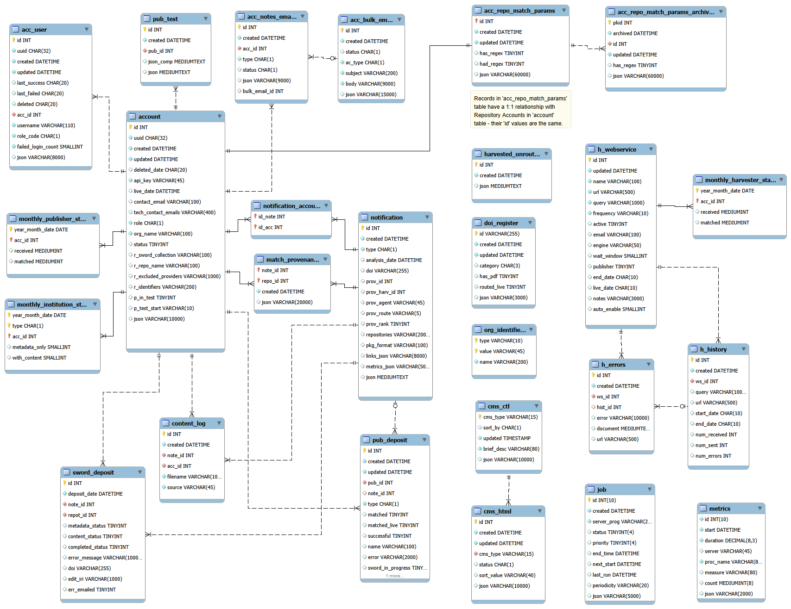

# Database

Publications Router uses 2 databases:
* Aurora MySQL - primary relational database
* Elasticsearch - temporary database used only by Harvester process.

The original version of Router used only Elasticsearch; but this was changed to MySQL for the following reasons:
* Reduced infrastructure cost (ES required xlarge server cluster)
* Efficiency (ES has no concept of updating a record, instead new records are created for each update, but the old - deleted - records can stay around for a long time increasing database size and access times)
* Flexibility & ease of reporting.

## MySQL
Router uses a separate AWS Aurora MySQL database for each environment: Production, Staging & Test. Each database is configured as a cluster, with a single _writer instance_ (used for read & write).

### PubRouter data storage & access

Internally Router's data is primarily stored as Python dictionaries and exposed (via API) as JSON objects.

Within the database, data is stored only in conventional (standard) relational database rows and columns. Router does NOT use database extensions designed to store & index JSON as this would have introduced proprietary dependencies on Oracle MySQL.

A very efficient library (MYSQL_DAO) was developed to store and retrieve Python dictionaries (JSON objects) from the MySQL database.  To store data, it converts Python dictionaries into database columns, one (or more) of which may contain a residual JSON object stored as a string (optionally compressed).  Any data that needs to be indexed must be extracted from the Python dict (JSON structure) into a regular database column. To retrieve data the process is reversed - combining data from regular database columns (1 or more of which may contain a JSON object stored as a string) into a Python dictionary.

All application database access is accomplished via _cursors_, with the SQL being defined in a single file.  This has three significant benefits:
* increased security
* enhanced performance (through cursor reuse)
* ease of maintenance.

For more information on Router's use of MySQL database see the [Development Guidelines](Developement_guidelines.md) page. 

### Aurora MySQL instances

| Aurora MySQL cluster          | Aurora MySQL instance | Description  | Specification | Notes |
|-------------------------------|---|---|---------------|---|
| dr-oa-prod-pubrouter-cluster  | dr-oa-prod-pubrouter | Production database | Serverless    | |
| dr-oa-stage-pubrouter-cluster | dr-oa-stage-pubrouter | Staging/UAT db | Serverless  | |
| dr-oa-test-pubrouter-cluster  | dr-oa-test-pubrouter | Test db | Serverless  | |

### Specific database parameter settings
The following parameters have been specifically configured via parameter groups `pubrouter-cluster-parameters` & `pubrouter-instance-parameters` (all other database parameters are kept as system defaults).

| Parameter name | Production | Notes |
|---|--------|---|
| group_concat_max_len | 20000  | Allows long strings to be created by GROUP_CONCAT - needed for formatting errors, among other things.  |
| interactive_timeout | 86400  |  Period in seconds (86400 -> 24h, 28800 -> 8h).  Prevents timeout errors - enables long running connections. |
| wait_timeout | 86400  | ditto |
| net_read_timeout | 90     | Changed to address 'Lost connection to MySQL server during query' error. |
| max_allowed_packet | 32000000 | Changed to address 'Lost connection to MySQL server during query' error. |

(In the original configuration, Staging & Test RDS database servers had different values from Production; but for ease of administration they now all use the production values).

**Note:** For maximum database access efficiency, Router's MySQL library uses cursors, with prepared statements, almost exclusively together with long-running connections.     

### Backups

The mySQL databases are backed up using AWS automated nightly snapshots.

### Restore from Backup

In summary, restore from a backup is accomplished by the following steps:

1. Deactivate Publications Router:
   * Via Gateway NGINX - put in place the maintenance screen
   * On both App1 & App2 servers stop all the Router processes (`supervisorctl stop all`)
2. Via AWS console - initiate a database restore from the required date/time
   * Navigate to Aurora MySQL database instance (e.g. `dr-oa-prod-pubrouter-cluster`) and from *Actions* drop-down menu select `Restore to point in time`
   * In the form, fill in the details (compare settings with original database version) - you will have to set a NEW name for the restored database server
3. Once the new (restored) database server is active (*running*) you will need to obtain its `connection-string`, which will then be used to update the `MYSQL_HOST` configuration setting in Router's *global_config*  (for speed of implementation this can be done by adding `MYSQL_HOST = "...connection string..."` to the Jenkins `~/.pubrouter/global.cfg` file on BOTH App1 & App2 servers)
4. After changing the *MYSQL_HOST* string the Router service can be reactivated:
   * On both App1 & App2 servers start the Router processes (`supervisorctl start all`)
   * Remove the Gateway NGINX maintenance screen
5. Once the new database server has "proved" satisfactory, the original database server can be deleted.

### Data Model

The datamodel shows relationships between tables (with foreign keys).  However, the database does not use foreign key constraints to maintain referential integrity for 2 principal reasons:
* Notifications are kept for only 3 months, but records in some related tables are kept longer
* Reduces processing overhead.

#### Table descriptions

| Table name                     | Content                                                                                                                                                                                                                                                                                                                                                                                                                                                                                                                      | Notes                                                                                                                                                                                                                                                                                                                                                                                     | Deletion strategy                                                                                                                                  |
|--------------------------------|------------------------------------------------------------------------------------------------------------------------------------------------------------------------------------------------------------------------------------------------------------------------------------------------------------------------------------------------------------------------------------------------------------------------------------------------------------------------------------------------------------------------------|-------------------------------------------------------------------------------------------------------------------------------------------------------------------------------------------------------------------------------------------------------------------------------------------------------------------------------------------------------------------------------------------|----------------------------------------------------------------------------------------------------------------------------------------------------|
| account                        | Organisation Account records, for following: * Admin accounts * Publisher accounts * Repository accounts. While the majority of information is stored in the `json` field, the following data (used in WHERE clauses or bespoke queries) is extracted into record fields: * uuid * deleted_date * api_key * live_date * contact_email * role * org_name * status * r_sword_collection * r_repo_name * r_excluded_providers * r_identifiers * p_in_test * p_test_start. | Fields with names begining "r_" are Repository account fields, those beginning "p_" are Publisher account fields, others are common across all account types.                                                                                                                                                                                                                             | Never actually deleted: records have *deleted_date* set to indicate effective deletion.                                                            |
| acc_user                       | User Account records (1 for each user) which are associated with `account` organisation records. Fields used in WHERE clause or retrieved in bespoke SQL are declared as columns, the rest are in the `json` field.                                                                                                                                                                                                                                                                                                       | |
| acc_bulk_email                 | Stores text (Subject & Body) and all the  To & CC addresses of Bulk emails that are created by the _Bulk email_ screen.                                                                                                                                                                                                                                                                                                                                                                                                      | Records in this table may be joined to the _acc_notes_emails_ table (which stores Organisation Account specific information for each Bulk email) by: `acc_notes_emails.bulk_email_id = acc_bulk_email.id`                                                                                                                                                                                 | Records with *deleted* status are purged after 12 months.                                                                                          |
| acc_notes_emails               | Stores text (Subject & Body), and for emails, the To & CC addresses of: * emails * notes * to-do's that are created/administered via the _Account Contact panel_ &/or _Recent errors screen_.  Stores Organisation Account To & CC addresses of Bulk emails that are created by the _Bulk email_ screen.                                                                                                                                                                                                   | For Bulk emails, this table is joined to the _acc_bulk_email_ table (which stores bulk email Subject & Body) by: `acc_notes_emails.bulk_email_id = acc_bulk_email.id`                                                                                                                                                                                                                     | Records with *deleted* status are purged after 12 months.                                                                                          |
| acc_repo_match_params          | Matching parameters for Repository accounts. The record `id` is the same as that of the Repository account record to which it relates. (E.g. Repository account with `id` 55 will have its matching parameters in  a record in this table also with `id` 55).                                                                                                                                                                                                                                                                | Matching parameters were originally stored in *account* records, however they can be very large (e.g. where hundreds of ORCIDs or Grant numbers are specified) which imposed unnecessary overhead when retrieving account data for other purposes.  Hence they were moved into this separate table, which also facilitated automatic archiving of old matching params when updates occur. | Never deleted.                                                                                                                                     |
| acc_repo_match_params_archived | Archives old matching parameters. New records are inserted whenever matching parameters change.                                                                                                                                                                                                                                                                                                                                                                                                                              | The main driver for this table was to be able to recover previous matching parameters (particularly those with Regex which may have been added by Jisc admins).                                                                                                                                                                                                                           | Deleted after 12 months.                                                                                                                           |
| cms_ctl                        | Control records for *Manage content* screen. Each record defines input fields, together with display templates etc. used on input form.                                                                                                                                                                                                                                                                                                                                                                                      |                                                                                                                                                                                                                                                                                                                                                                                           | Never deleted.                                                                                                                                     |
| cms_html                       | Records containing HTML markup (input via *Manage content* screen) for display on particular web pages.                                                                                                                                                                                                                                                                                                                                                                                                                      |                                                                                                                                                                                                                                                                                                                                                                                           | Records with *deleted* or *superseded* status are deleted after 2 months.                                                                          |
| content_log                    | Records each retrieval of notification content (zip file or PDF) via Router API.                                                                                                                                                                                                                                                                                                                                                                                                                                             | The *source* field indicates any problems.                                                                                                                                                                                                                                                                                                                                                | Deleted after 3 months.                                                                                                                            |
| doi_register                   | Records DOI for routed notifications processed by router, together with account IDs for repositories that notification was routed to.  Used for duplicate handling.                                                                                                                                                                                                                                                                                                                                                          |                                                                                                                                                                                                                                                                                                                                                                                           | Never deleted.                                                                                                                                     |
| job                            | Records for each job that is configured.  Records are created when an application is started and deleted when it terminates. They are constantly updated as jobs run.                                                                                                                                                                                                                                                                                                                                                        |
| match_provenance               | For every routed notification, for each institution matched, stores evidence of the matching parameter that matched particular metadata.                                                                                                                                                                                                                                                                                                                                                                                     |                                                                                                                                                                                                                                                                                                                                                                                           | Deleted after 3 months.                                                                                                                            |
| metrics                        | Stores a record of each _batch_ process that is executed by Router's scheduler, containing start time, duration, process name, server on which it is executed, number of items processed etc..                                                                                                                                                                                                                                                                                                                               |                                                                                                                                                                                                                                                                                                                                                                                           | Deleted after 24 months.                                                                                                                           |
| harvested_unrouted             | Table containing unrouted notifications populated by the Harvester process.  After the harvest, when all records have been processed (after any matched notifications have been inserted into *notification* table) the table is emptied.                                                                                                                                                                                                                                                                                    |                                                                                                                                                                                                                                                                                                                                                                                           | Deleted by table truncation after each processing of the records contained in table.                                                               |
| notification                   | Stores notifications, both unrouted (from publishers) and routed (from publishers & harvester).                                                                                                                                                                                                                                                                                                                                                                                                                              |                                                                                                                                                                                                                                                                                                                                                                                           | Unrouted notifications are deleted once they have been through the matching (routing) process. Routed notifications are deleted after 3 months. |
| notification_account           | Linking table, each record relates a routed notification to a repository account.                                                                                                                                                                                                                                                                                                                                                                                                                                            |                                                                                                                                                                                                                                                                                                                                                                                           | Deleted after 3 months (by the *notification* deletion query).                                                                                     |
| org_identifiers                | Stores JISC and CORE institution identifiers used to populate drop down when setting those values for repository accounts.                                                                                                                                                                                                                                                                                                                                                                                                   |                                                                                                                                                                                                                                                                                                                                                                                           | Never deleted.                                                                                                                                     |
| pub_deposit                    | Records each deposit made by a publisher (by either API or SFTP submission).                                                                                                                                                                                                                                                                                                                                                                                                                                                 |                                                                                                                                                                                                                                                                                                                                                                                           | Deleted after 12 months.                                                                                                                           |
| pub_test                       | Records each publisher submission (validation) test.                                                                                                                                                                                                                                                                                                                                                                                                                                                                         |                                                                                                                                                                                                                                                                                                                                                                                           | Deleted after 12 months.                                                                                                                           |
| sword_deposit                  | Records each attempted deposit (via SWORD2 protocol) into an institution repository. In event of failure it records error details, if successful it records URI of the created repository record.                                                                                                                                                                                                                                                                                                                            |                                                                                                                                                                                                                                                                                                                                                                                           | Deleted after 12 months.                                                                                                                           |
| h_webservice                   | Harvester webservice records - each defines key information required to perform a harvest.                                                                                                                                                                                                                                                                                                                                                                                                                                   |                                                                                                                                                                                                                                                                                                                                                                                           | Never deleted.                                                                                                                                     |
| h_errors                       | Records errors occurring during harvest.                                                                                                                                                                                                                                                                                                                                                                                                                                                                                     |                                                                                                                                                                                                                                                                                                                                                                                           | Deleted after 3 months.                                                                                                                            |
| h_history                      | Records summary of each harvest.                                                                                                                                                                                                                                                                                                                                                                                                                                                                                             |                                                                                                                                                                                                                                                                                                                                                                                           | Deleted after 3 months.                                                                                                                            |
| monthly_institution_stats      | Monthly statistics for Live and Test repositories: recording the number of notifications received and the number matched.                                                                                                                                                                                                                                                                                                                                                                                                    | Records created by monthly reporting service.                                                                                                                                                                                                                                                                                                                                             | Never deleted.                                                                                                                                     |
| monthly_publisher_stats        | Monthly statistics for publishers: recording the number of notifications received and the number matched.                                                                                                                                                                                                                                                                                                                                                                                                                    | Records created by monthly reporting service.                                                                                                                                                                                                                                                                                                                                             | Never deleted.                                                                                                                                     |
| monthly_harvester_stats        | Monthly statistics for harvesters recording the number of notifications received and the number matched to LIVE repository accounts.                                                                                                                                                                                                                                                                                                                                                                                         | Records created by monthly reporting service.                                                                                                                                                                                                                                                                                                                                             | Never deleted.                                                                                                                                     |

### Interacting with the MySQL database

#### Key Python code related to database access

The following library files are pivotal in accessing database data.

| Python file | Contents |
|---|---|
| src/router/shared/**mysql_dao.py** | DAO1 classes for ALL database tables (summarised above). Defines, among other things: * mapping of database columns to JSON fields * all the SQL queries required for various cursors (query, update, insert, delete). |
| src/router/shared/**mysql_db_ddl.py** | DDL2 for table (& associated index) creation - used particularly by automated test code. (Must be kept in step with actual MySQL database, which is administered via SQL scripts). |
| octopus/modules/mysql/**dao.py** | Fundamental library that enables relational tables to be represented by class objects, together with related CRUD (create, read, update and delete) functions.  Core to this is the automatic translation of python dicts to record fields and/or JSON structures stored in the record <code>json</code> field.  The underlying concept is that complex JSON structures can be simply stored in a record - either as an entire JSON object, or as a "partial" JSON object with key data elements (e.g. those used in WHERE clauses) automatically extracted and stored in other record fields.  Alternative Read functions are provided, including *Pull* functions that return a whole set of records and *Scroller* functions that retrieve a full set of record in batches to reduce memory usage. | 
| octopus/modules/mysql/**utils.py** | Functionality for executing DDL - particularly used by automated test functions; also useful for migration & other one-off scripts. |

##### NOTES:
1. DAO: Data Access Object
2. DDL: Data Definition Language

### Database changes - Guidelines

If you need to change the database, for example adding new data tables or indexes or modifying existing tables or indexes, take note of the following:

* Changes MUST be reflected in the ***mysql_db_ddl.py*** file (which is used by test scripts to create the test database)
* ALL data access must be achieved via the existing cursor mechanism - which is "governed" by the DAO classes in ***mysql_dao.py*** file.  So, new tables will necessitate creation of new DAO classes (in that file), and existing table structure changes will (likely) require some modification to existing classes.  In order to do this you will need to be familiar with the Octopus MySQL ***dao.py*** library mentioned in the preceding section.
 

## Elasticsearch

The Elasticsearch database is used by the Harvester process as an intermediate store of harvested notifications.  These are then filtered, prior to inserting them into the MySQL database (*harvested_unrouted* table).

The database is used for <1 hour overnight.  In Production it runs on a server that is Started at midnight & Stopped at 2am. (In the future this may move to an AWS OpenSearch solution that is created when needed and then destroyed.)

The Harvester process creates & destroys (temporary) indexes for the following harvested sources:
* Elsevier
* Pubmed
* EPMC
* Crossref.

Index names are derived from name of harvested source and the harvested webservice record id (*h_webservice* MySQL table). 

Index mappings are defined in Harvester config file: *src/router/harvester/config/base.py*.

Because of the transient nature of the indexes, there is no need to perform backups or similar administration, and there is no need for a fault-tolerant Elasticsearch cluster.
