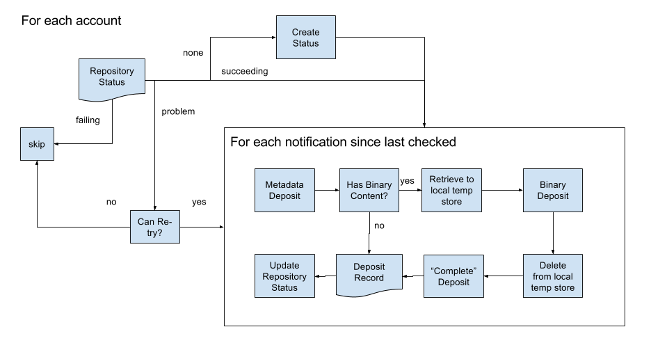

# SWORD-Out

## Contents
* Information on [data models](./MODELS.md)
* Public documentation on [SWORD-Out](https://github.com/jisc-services/Public-Documentation/blob/master/PublicationsRouter/sword-out/README.md), including XML formats for Eprints & DSpace repositories supported by Router

## SWORDv2 Deposit Client

This process consumes routed notifications on behalf of a repository and then re-packages the 
content as a SWORDv2 deposit which is then delivered to the repository in upto 3 steps:
* Metadata deposit, which creates the repository record
* Content deposit, which adds content file(s) to the repository record
* Complete deposit, which _tells_ the repository that the deposit is complete.

The overall workflow that the Deposit Client executes is as follows:

